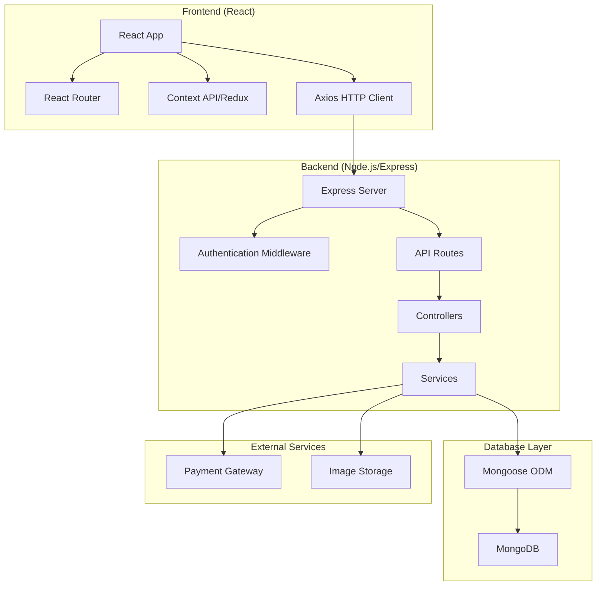

# Design Document

## Overview

Black Market is a full-stack MERN (MongoDB, Express.js, React, Node.js) e-commerce application that provides an immersive sci-fi themed platform for purchasing alien collectible cards. The application follows a modern microservices-inspired architecture with clear separation between frontend and backend concerns, implementing RESTful APIs and responsive design patterns.

## Architecture

### High-Level Architecture



### Technology Stack

**Frontend:**

- React 18+ with functional components and hooks
- React Router for client-side routing
- Context API or Redux Toolkit for state management
- Axios for HTTP requests
- Tailwind CSS for styling and responsive design
- React Hook Form for form handling

**Backend:**

- Node.js with Express.js framework
- MongoDB with Mongoose ODM
- JWT for authentication
- Bcrypt for password hashing
- Multer for file uploads
- Express-validator for input validation

**Development Tools:**

- Vite for frontend bundling
- Nodemon for backend development
- ESLint and Prettier for code quality

## Components and Interfaces

### Frontend Component Structure

```
src/
├── components/
│   ├── common/
│   │   ├── Header.jsx
│   │   ├── Footer.jsx
│   │   ├── LoadingSpinner.jsx
│   │   └── ErrorBoundary.jsx
│   ├── alien/
│   │   ├── AlienCard.jsx
│   │   ├── AlienCarousel.jsx
│   │   ├── AlienDetail.jsx
│   │   ├── AlienList.jsx
│   │   └── AlienFilters.jsx
│   ├── cart/
│   │   ├── Cart.jsx
│   │   ├── CartItem.jsx
│   │   └── Checkout.jsx
│   ├── user/
│   │   ├── Login.jsx
│   │   ├── Register.jsx
│   │   ├── Profile.jsx
│   │   └── Wishlist.jsx
│   └── admin/
│       ├── AdminPanel.jsx
│       ├── AlienForm.jsx
│       └── Analytics.jsx
├── pages/
│   ├── HomePage.jsx
│   ├── AlienListPage.jsx
│   ├── AlienDetailPage.jsx
│   ├── CartPage.jsx
│   └── AdminPage.jsx
├── context/
│   ├── AuthContext.jsx
│   ├── CartContext.jsx
│   └── AlienContext.jsx
├── services/
│   ├── api.js
│   ├── authService.js
│   ├── alienService.js
│   └── cartService.js
└── utils/
    ├── constants.js
    ├── helpers.js
    └── validators.js
```

### Backend API Structure

```
server/
├── controllers/
│   ├── alienController.js
│   ├── authController.js
│   ├── cartController.js
│   ├── orderController.js
│   └── adminController.js
├── models/
│   ├── Alien.js
│   ├── User.js
│   ├── Order.js
│   └── Cart.js
├── routes/
│   ├── aliens.js
│   ├── auth.js
│   ├── cart.js
│   ├── orders.js
│   └── admin.js
├── middleware/
│   ├── auth.js
│   ├── admin.js
│   ├── validation.js
│   └── upload.js
├── services/
│   ├── alienService.js
│   ├── authService.js
│   ├── paymentService.js
│   └── emailService.js
└── utils/
    ├── database.js
    ├── constants.js
    └── helpers.js
```

### API Endpoints

**Authentication Routes:**

- `POST /api/auth/register` - User registration
- `POST /api/auth/login` - User login
- `GET /api/auth/profile` - Get user profile
- `PUT /api/auth/profile` - Update user profile

**Alien Routes:**

- `GET /api/aliens` - Get all aliens with filtering/search
- `GET /api/aliens/:id` - Get single alien details
- `GET /api/aliens/:id/related` - Get related aliens
- `POST /api/aliens` - Create alien (admin only)
- `PUT /api/aliens/:id` - Update alien (admin only)
- `DELETE /api/aliens/:id` - Delete alien (admin only)

**Cart Routes:**

- `GET /api/cart` - Get user's cart
- `POST /api/cart/add` - Add item to cart
- `PUT /api/cart/update` - Update cart item quantity
- `DELETE /api/cart/remove/:id` - Remove item from cart

**Order Routes:**

- `POST /api/orders` - Create new order
- `GET /api/orders` - Get user's orders
- `GET /api/orders/:id` - Get specific order details

**Wishlist Routes:**

- `GET /api/wishlist` - Get user's wishlist
- `POST /api/wishlist/add` - Add alien to wishlist
- `DELETE /api/wishlist/remove/:id` - Remove from wishlist

## Data Models

### Alien Model

```javascript
{
  _id: ObjectId,
  name: String (required),
  faction: String (required),
  planet: String (required),
  rarity: String (enum: ['Common', 'Rare', 'Epic', 'Legendary']),
  price: Number (required),
  image: String (URL),
  backstory: String,
  abilities: [String],
  clothingStyle: String,
  featured: Boolean (default: false),
  inStock: Boolean (default: true),
  createdAt: Date,
  updatedAt: Date
}
```

### User Model

```javascript
{
  _id: ObjectId,
  email: String (required, unique),
  password: String (required, hashed),
  firstName: String,
  lastName: String,
  isAdmin: Boolean (default: false),
  wishlist: [ObjectId] (ref: 'Alien'),
  createdAt: Date,
  updatedAt: Date
}
```

### Order Model

```javascript
{
  _id: ObjectId,
  user: ObjectId (ref: 'User'),
  items: [{
    alien: ObjectId (ref: 'Alien'),
    quantity: Number,
    price: Number
  }],
  totalAmount: Number,
  shippingAddress: {
    street: String,
    city: String,
    state: String,
    zipCode: String,
    country: String
  },
  paymentStatus: String (enum: ['pending', 'completed', 'failed']),
  orderStatus: String (enum: ['processing', 'shipped', 'delivered']),
  createdAt: Date,
  updatedAt: Date
}
```

### Cart Model (Session-based)

```javascript
{
  _id: ObjectId,
  user: ObjectId (ref: 'User', optional for guest carts),
  sessionId: String (for guest carts),
  items: [{
    alien: ObjectId (ref: 'Alien'),
    quantity: Number
  }],
  createdAt: Date,
  updatedAt: Date
}
```

## Error Handling

### Frontend Error Handling

- Global error boundary component to catch React errors
- Axios interceptors for handling HTTP errors
- Toast notifications for user-friendly error messages
- Form validation with real-time feedback
- Loading states and error states for all async operations

### Backend Error Handling

- Global error handling middleware
- Custom error classes for different error types
- Input validation using express-validator
- Database error handling with meaningful messages
- Logging system for debugging and monitoring

### Error Response Format

```javascript
{
  success: false,
  error: {
    message: "User-friendly error message",
    code: "ERROR_CODE",
    details: {} // Additional error details for debugging
  }
}
```

## Testing Strategy

### Frontend Testing

- **Unit Tests:** Jest and React Testing Library for component testing
- **Integration Tests:** Testing user flows and component interactions
- **E2E Tests:** Cypress for critical user journeys
- **Visual Tests:** Storybook for component documentation and visual testing

### Backend Testing

- **Unit Tests:** Jest for testing individual functions and services
- **Integration Tests:** Supertest for API endpoint testing
- **Database Tests:** In-memory MongoDB for isolated testing
- **Load Tests:** Artillery or similar for performance testing

### Test Coverage Goals

- Minimum 80% code coverage for critical business logic
- 100% coverage for payment and authentication flows
- Comprehensive testing of all API endpoints
- Cross-browser testing for frontend components

### Testing Environment Setup

- Separate test databases for isolation
- Mock external services (payment gateways, email services)
- Automated testing in CI/CD pipeline
- Performance benchmarks for key operations

## Security Considerations

### Authentication & Authorization

- JWT tokens with appropriate expiration times
- Password hashing using bcrypt with salt rounds
- Role-based access control for admin functions
- Session management for cart persistence

### Data Protection

- Input sanitization and validation
- SQL injection prevention through Mongoose
- XSS protection with proper data encoding
- CORS configuration for API access control

### Payment Security

- PCI DSS compliance considerations
- Secure payment token handling
- HTTPS enforcement for all transactions
- Payment data encryption at rest and in transit

## Performance Optimization

### Frontend Optimization

- Code splitting and lazy loading for routes
- Image optimization and lazy loading
- Memoization of expensive computations
- Virtual scrolling for large alien lists
- Service worker for caching static assets

### Backend Optimization

- Database indexing for search and filter operations
- Query optimization and aggregation pipelines
- Caching frequently accessed data (Redis)
- Image compression and CDN integration
- API response pagination

### Database Design

- Proper indexing strategy for search functionality
- Denormalization where appropriate for read performance
- Connection pooling for database efficiency
- Regular database maintenance and optimization
